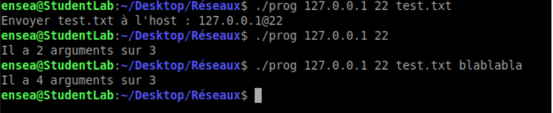

# Compte rendu, Lanfredi Camille, Weidle Rémi
2G2.TP1.1D1 | ENSEA 2023

## TP 1
### Question 1 : 

> Lors de cette première question on cherche à recréer un terminal. On affiche donc un message de bienvenue ainsi que le début  

>[!NOTE]
>Le début de l'interpreteur sera enseash%   
>De même il n'est pas possible de quitter le programme car nous n'avons pas configuré l'exit (Q3). On doit donc utiliser Ctrl+C.

### Question 2 : 

> Cette fois ci on cherche soit à afficher la date ou alors executer la commande. Pour ce faire nous excluons le cas ou aucune commande est envoyé,     Puis si une commande est utilisé nous l'éxécutons puis nous revenons au 'terminal'. 

>[!TIP]
>Comme nous utilisons execlp nous devons faire un fork afin que lorsque le fils a finit d'éxécuter on ne sorte pas du 'shell' reproduit. Le processus père est donc en attente de son fils avant de pouvoir continuer...  

>[!WARNING]
>Ici le exit ne fonctionne toujours pas on doit utiliser Ctrl+C  

### Question 3 : 

> Dans cette question ajoute seulement de quoi sortir de notre programme sans avoir à utiliser le Ctrl+C. On va donc tester si la commande rentrée est "exit". On souhaite donc le placer avant le fork histoire d'éviter à fork de facon inutile...  
>On voit deux exit sur le screen plus bas un réalisé avec la commande "exit" et l'autre avec la commande Ctrl+D.  

>[!WARNING]
>Il faut faire attention car on le compare à "exit" qui est une chaine de charactères. Par conséquent si on le place avant   
>commande[input_length - 1] = '\0';   
>Le test sera inefficace car la comparaison avec la chaine de charactères sera toujours fausse car elle ne se finti aps par '/0'  

### Question 4 : 

> Afin d'ecrire l'exit status et le signal information on s'aide du cour avec WEXITSTATUS ainsi que WIFSIGNALED. 

>[!CAUTION]
>Nous avons particulièrement testé pour les exit status mais en ce qui concerne du signal nous n'avons pas éssayé actuellement si tout marche correctement.  

### Question 5 : 

>[!TIP]
> Pour réussir cette question on décide de mesurer le temps d'éxecution avec les portes :    
> clock_gettime(CLOCK_REALTIME, &timeStart);  
> clock_gettime(CLOCK_REALTIME, &timeStop);  
> Qui fonctionne a peu près comme des stamp en microP.   

> On place donc le début du timer avant le fork et la fin du timer lorsque le processus père a finit d'attendre le fils donc que celui-ci a finit de travailler. Comme cela on a le temps que tout marche correctement. On convertit le temps ensuite en ms pour cque cela soit plus aprlant qu'en ns. 

>[!NOTE]
>Après avoir testé la fonction, la fonction ls dure 0ms (donc très peu)  
>Fortune avec peu de texte ~3ms  
>Fortune avec un gros texte ~15ms  

### Question 6 : 
>[!NOTE]
>Le shell prend désormais en charge les arguments de commande. Il utilise strtok pour l'analyse et execvp pour une exécution efficace des commandes avec les arguments spécifiés.  
>Pour cela nous divisons en deux la partie commande de la partie arguments pour ensuite utiliser le excvp au lieu du execlp.

>[!TIPS]
>Le code fonctionne trés bien même avec des commandes plus complexes comme nmap -p ...

### Question 7 :
>[!NOTE]
>Pour la question 7 on utilise ce qui a été réalisé dans la question 6 mais on regarde si un argument correspond si un "argument" serait < ou >. Si tel est le cas on remplace < ou > par NULL pour différentier le fichier à créer (après) et la commande avec arguments (avant). Ensuite on différentie si le fichier est utilisé pour un input et un output afin de répondre à la demande. 

>[!WARNING]
>On pense bien à faire des levées d'erreurs afin de s'assurer qu'il n'y ait pas de soucis. 

Voici la création du fichier texte filelist contenant la liste de toutes les fichiers 

### Question 8 : 
>[!NOTE]
>La question 8 suit la question 7 ou on vérifie les arguments et si un argument correspond à | on fork deux processus. L'un est utilise pour la première partie de la commande et le deuxième pour l'autre partie ce qui permet d'éxecuter toute la commande sans soucis. 
>On pense comme avant de bien penser à remplacer | par NULL afin de pas avoir d'erreur dans la determination des commande/arguments.  

