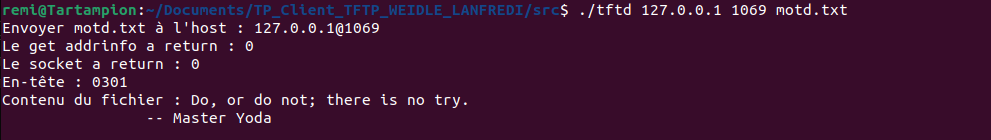
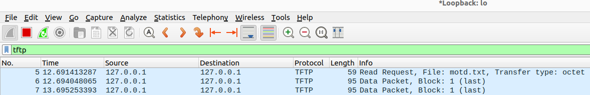
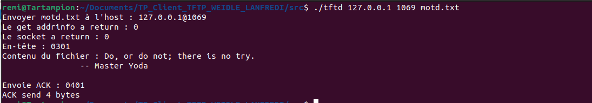
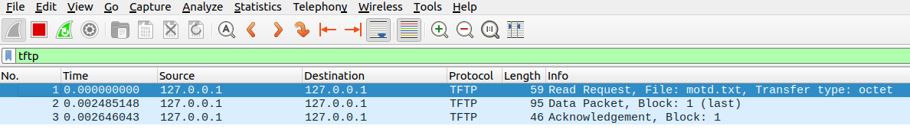
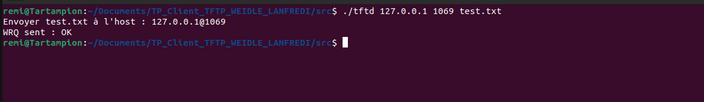
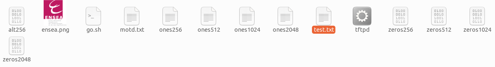

# Compte rendu, Lanfredi Camille, Weidle Rémi
2G2.TP1.1D1 | ENSEA 2023

## TP2 : Majeure Info
### Question 1 : 

> 

> On récupère dans argv[1] l’adresse du serveur (on pourrait augmenter la taille du char pour accepter des adresses plus longues, mais dans notre cas c’est suffisant), et on le place dans la variable host  
> Dans argv[2] on trouve le port.   
>Et dans argv[3] le nom du fichier concerné qu’on place dans la variable file  

>[!NOTE]
> On a décidé d'ajouter un test afin de s'assurer que tous les arguments soient bien remplis lors du démarrage du programme sinon on fait une levée d'erreur  

>[!Note]
>Piur l'instant, le programme est conçu pour envoyer un fichier spécifié à un hôte et un port spécifiés. 
Il vérifie, dans un premier temps, si le bon nombre d’arguments a été fourni.
>- Si ce n’est pas le cas, il affiche un message d’erreur. 
>- Si le nombre correct d’arguments a été fourni, il affiche un message indiquant le nom du fichier à envoyer, l’hôte et le port.
>
>Les arguments : ***argv[1]***, ***argv[2]*** et ***argv[3]*** sont utilisés pour stocker l’hôte, le port et le nom du fichier.

### Question 2 : ***getaddinfo***

>[!NOTE]
> Puis, à partir de ***getaddinfo***, nous obtenons l'adresse du serveur.

>[!NOTE]
>Ce programme client utilise les sockets UDP pour envoyer un fichier à un hôte.
Après avoir vérifier le nombre d'arguments, il utilise la fonction ***getaddrinfo*** pour obtenir des informations sur l’hôte et le port spécifiés. Si getaddrinfo renvoie une erreur, le programme affiche un message d’erreur et se termine.

### Question 3 : 
 
>[!NOTE]
>

>[!Note]
>Ce code permet de créer un socket en utilisant les informations obtenues par la fonction ***getaddrinfo***. La fonction socket crée un point de terminaison pour la communication et renvoie un descripteur, comprenant : le domaine de la socket (IPv4, IPv6), le type de socket (flux) et le protocole. 
>- Si la création de la socket est réussie, le descripteur de la socket est un entier positif. 
>- Si la création de la socket échoue, elle renvoie -1, et le programme affiche un message d'erreur. 

### Question 4 : ***gettftp***

#### Construction d'une requete lecture (RRQ)

>[!Note]
>La RRQ est stockée dans une mémoire tampon, qui est ensuite envoyée au serveur à l'aide de la fonction ***sendto***.Elle comprend le nom du fichier et le mode de transfert.
>- Si la fonction ***sendto*** renvoie -1, une erreur s'est produite et le programme renvoie un message.
>
>Le padding + padding2 + 4 dans l'appel de fonction ***sendto*** est la longueur totale du RRQ, y compris l'opcode, le nom de fichier, l'octet nul, le mode et l'octet nul final.Le 0 dans l'appel de la fonction sendto est le paramètre flags, qui est mis à 0 pour l'absence de flags.Les paramètres res -> ai_addr et res->ai_addrlen dans l'appel de la fonction ***sendto*** sont respectivement l'adresse de destination et la longueur de l'adresse, qui ont été obtenues à partir de l'appel de la fonction ***getaddrinfo***.

#### Réception d'un fichier avec un seul paquet de données (DAT) et son aqcquittement (ACK)

>[!Note]
Ce code reçoit un paquet de données du serveur, imprime l'en-tête et le contenu du paquet de données, puis renvoie un accusé de réception (ACK) au serveur.Le paquet de données et l'ACK sont tous deux stockés dans un tampon.
>La fonction ***recvfrom*** est utilisée pour recevoir le paquet de données du serveur et la fonction ***sendto*** est utilisée pour envoyer l'ACK 
au serveur.
>- Si l'une de ces fonctions renvoie -1, une erreur s'est produite et le programme imprime un message d'erreur et se termine par une erreur.L'en-tête du paquet de données et l'ACK ont tous deux une longueur de quatre octets, le deuxième octet indiquant le type du paquet (3 pour les 
données, 4 pour l'ACK).
>
>Le contenu du paquet de données commence au cinquième octet de la mémoire tampon. Le contenu du fichier étant imprimé sous forme de caractères, ce code suppose que le fichier est un fichier texte. 
>- Si le fichier est un fichier binaire, le contenu du fichier peut ne pas être imprimé correctement.

#### Réception d'un fichier avec plusieurs paquets de données (DAT) et leurs acquittements (ACK).

>[!NOTE]
>Le programme continue à recevoir des données tant qu’il recevra des paquets de taille maximale.
>
>La fonction ***recvfrom*** permet de recevoir des données du socket. 
>- Si une erreur se produit lors de la réception des données, le programme affiche l’erreur et se termine.
>
>Les quatre premiers octets reçus sont affichés en hexadécimal. Ces octets représentent généralement l’en-tête du paquet.
>Le reste des octets reçus est affiché en décimal. Ces octets représentent le contenu du fichier.
>
>Le deuxième octet du tampon est défini sur 4. Cela représente le code d’opération ACK dans le protocole TFTP.
>
>La fonction ***sendto*** envoie l’ACK. 
>- Si une erreur se produit lors de l’envoi de l’ACK, le programme affiche l’erreur et se termine.

### Question 5 : "puttftp"

#### Contruction d'une requete en écriture (WRQ), et envoie au serveur

>[!NOTE]
>Ce programme est un simple client UDP qui envoie une requête d'écriture (WRQ) à un serveur. 
>Il prend trois arguments en ligne de commande : l'hôte, le port et le nom du fichier.
>
> Le programme crée ensuite une socket UDP et envoie une WRQ pour le fichier spécifié au serveur sur l'hôte et le port donnés. 
>- Si une étape échoue, le programme affiche un message d'erreur et se termine. 
>- Si le WRQ est envoyé avec succès, le programme affiche un message de réussite et se termine.

#### Envoi d'un fichier avec un seul paquet de données (DAT) et réception (ACK)

#### Envoi d'un fichier avec plusieurs paquets de données (DAT) et réception de leurs acquittements (ACK)

