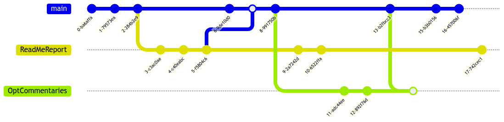

# TP_Client_TFTP_WEIDLE_LANFREDI
TP de réseaux : Weidle &amp; Lanfredi

## [Compte Rendu du TP ](Compte_Rendu/REPORT.md)

>[!IMPORTANT]
> Le compte rendu du TP est écrit dans le dossier Compte_Rendu avec les captures d'écran justificatives dans le dossier capture  
> On tiendra ci-joint le journal de bord de l'avancée du TP :

 ### Journal de Bord

>[!NOTE]
> 13/12 -> Création du Github, Organisation du github  
- [x] Question 1 :tada:  
- [x] Question 2 :tada:  
- [x] Question 3 :tada:
- [x] Question 4 :tada:

## Organisation du Github
>[!IMPORTANT]
> Le github s'organise en trois dossiers  
> src -> Qui gère les dossiers en C qui reppond aux questions.  
> Compte_Rendu avec tous les fichiers relatifs au compte_Rendu  
> captures -> Captures d'écran du compte rendu...  
    
### Fichier gitignore
>[!NOTE]
> Docs .gitignore
> celui-ci a été écrit pour ne pas avoir à gérer les captures d'écran  
> les fichiers de compilations et programmes générées par gcc  
> autres fichiers inutiles   

### Organisation des commit 
>[!IMPORTANT]
> Le github s'organise en trois branches  
> main --> qui correspond à la branche de base   
> ReadMe+Report --> S'occupe du compte rendu  
> OptCommentaries --> Optimise le code et ajout tous les commentaires  
> On utilise les pull request et les merges afin de s'assurer qu'il n'y ait aucun conflits...  

>[!TIP]
> Exemple de structure git utilisé dans le projet...   

